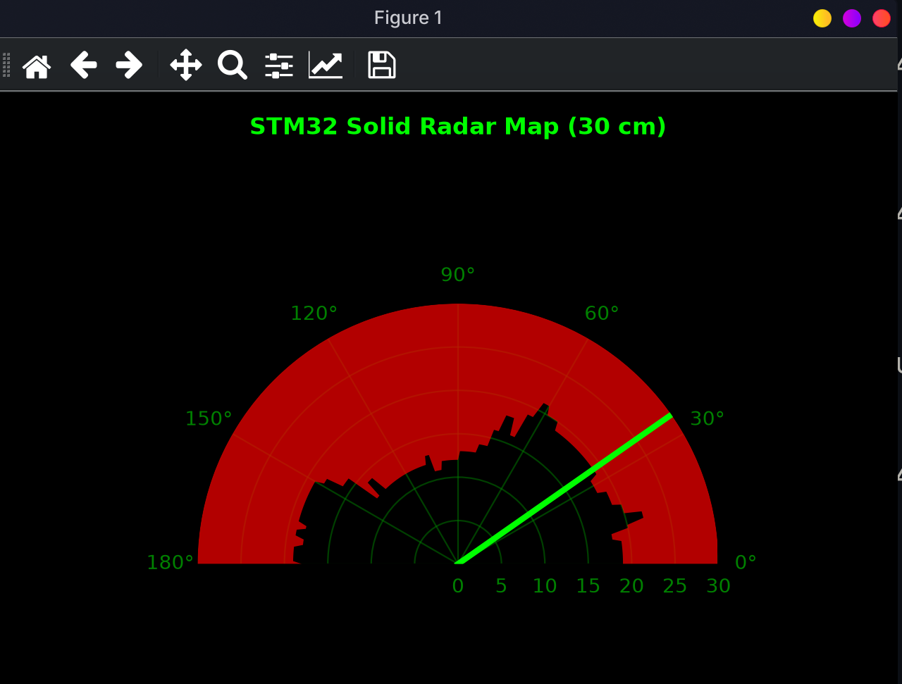
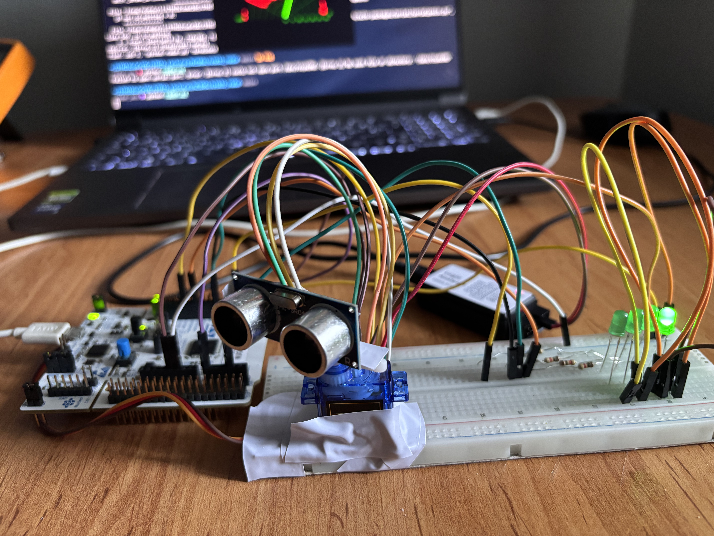
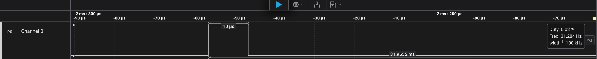
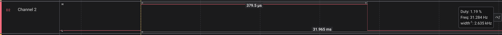

# STM32 Non-Blocking Ultrasonic Radar System

This project implements a real-time, hardware-driven radar system using an STM32 microcontroller, an HC-SR04 ultrasonic sensor, and a servo motor. It features a fully non-blocking embedded architecture utilizing STM32 Low-Layer (LL) drivers and a sleek, dynamic Python graphical user interface (GUI) to visualize the surroundings.

## 📸 Project Showcase

### Radar Graphical User Interface (GUI)

*The Python-based GUI uses Matplotlib to map objects dynamically within a 30 cm radius. Obstacles are rendered as solid red fills for clear visibility.*

### Hardware Setup

*STM32 development board interfaced with an HC-SR04 sensor mounted on a servo motor, complete with status LEDs.*



---

## ✨ Key Features

* **Zero CPU Load Measurement:** Uses Timer 1 (TIM1) in **Slave/Gated Mode** to measure the HC-SR04 Echo pulse width purely at the hardware level, freeing up the CPU.
* **Hardware-Level Triggering:** Uses Timer 3 (TIM3) in **One-Pulse Mode (OPM)** to generate precise 10 microsecond trigger pulses without blocking delays (`LL_mDelay`).
* **Interrupt-Driven Sweep:** Servo motor positioning and sensor polling are managed via the **SysTick Interrupt**, establishing a robust State Machine architecture.
* **Real-Time Python GUI:** A custom Python script reads UART data stream and renders a 180-degree polar radar map with dynamic polygon spreading for solid object visualization.

---

## 🛠️ Hardware Requirements

*   **Microcontroller:** STM32 Development Board (e.g., STM32G0 series)
*   **Sensor:** HC-SR04 Ultrasonic Distance Sensor (powered via 5V pin)
*   **Actuator:** SG90 Micro Servo Motor
*   **Miscellaneous:** Breadboard, jumper wires, and optional LEDs for debugging

### 🔌 Pin Configuration

| Component | STM32 Pin | Function / Alternate Function |
| :--- | :--- | :--- |
| **Servo PWM** | `PA0` | `TIM2_CH1` (AF2) - 50Hz PWM Output |
| **HC-SR04 Trigger** | `PA6` | `TIM3_CH1` (AF1) - One-Pulse Mode |
| **HC-SR04 Echo** | `PA8` | `TIM1_CH1` (AF2) - Input Capture Gated Mode |
| **UART TX** | `PA2` | `USART2_TX` (AF1) - 115200 Baud |
| **UART RX** | `PA3` | `USART2_RX` (AF1) - 115200 Baud |
| **Status LEDs** | `PB0 - PB3` | Standard GPIO Output |

---

## 🚀 Software Installation & Usage

### 1. Embedded Setup (C Code)
The embedded code is written using STM32CubeIDE and strictly utilizes **ST Low-Layer (LL) drivers** for maximum performance and register-level control.
1. Open the project in STM32CubeIDE.
2. Build and flash the firmware to your STM32 board.
3. Ensure the HC-SR04 `VCC` is connected to a **5V** source, as 3.3V will result in acoustic locking and inaccurate measurements.

### 2. Python GUI Setup (Linux / macOS / Windows)
The visualization script expects serial data in the format `Aci:X,Mesafe:Y\n`. It is recommended to run the script inside a Python virtual environment.

**Create and activate a virtual environment:**
```bash
python -m venv radar_env
source radar_env/bin/activate  # On Windows use: radar_env\Scripts\activate
```
Install dependencies:
```bash
pip install pyserial matplotlib numpy PyQt6
```
Run the GUI:
Before running, ensure the SERIAL_PORT variable in the script matches your device (e.g., /dev/ttyACM0 for Linux/ST-Link, or COM3 for Windows).
```bash
python radar.py
```
Note for Linux users: If you encounter a "Permission Denied" error for the serial port, ensure your user is added to the uucp and lock (or dialout) groups.